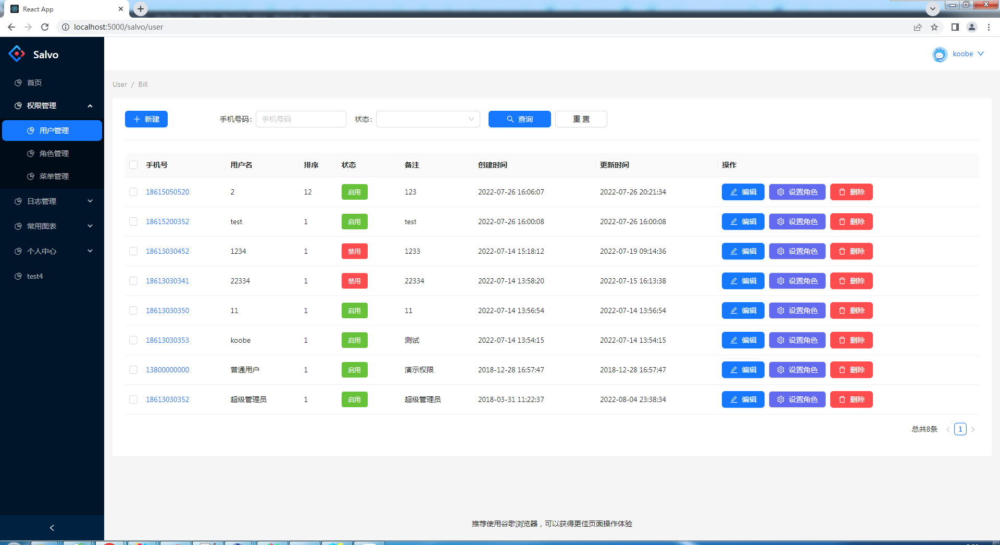
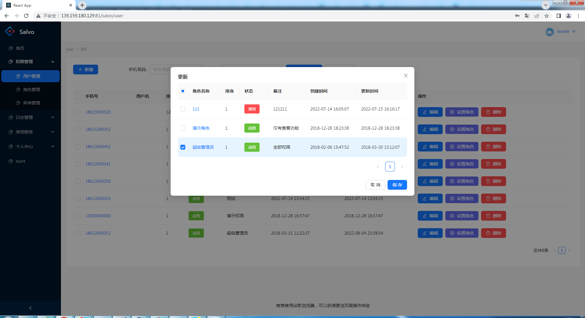
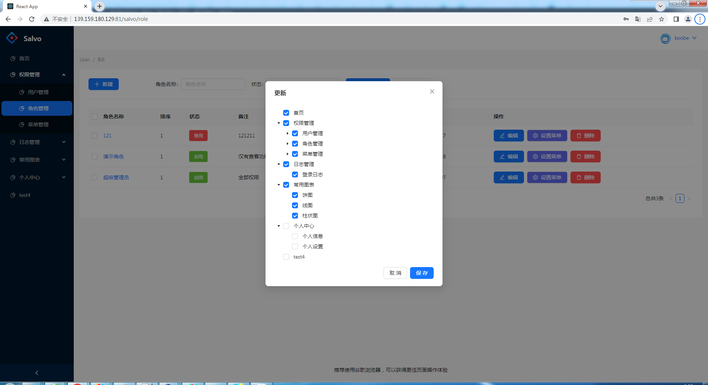

# salvo-admin-ui 是salvo+rbatis的前端项目

# 后端项目

```
https://github.com/feihua/salvo_admin.git
```

# 启动项目

## 1.安装依赖

```npm install --force```

## 2.本地启动项目

```npm run start 在浏览器输入：http://localhost:5000/salvo就可以预览了(前提要启动salvo-admin后端项目)```

## 3.打包项目(部署)

```npm run build```

# 项目预览

## 首页


## 用户界面



## 角色分配界面



## 角色界面


## 菜单分配界面



## 菜单界面

